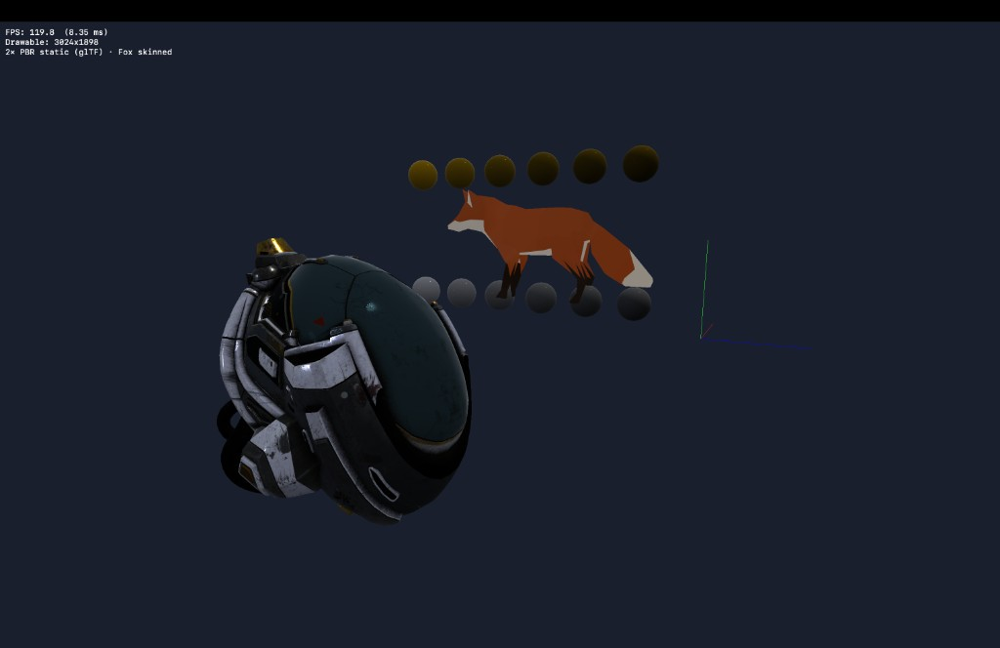

# BestGame

Небольшой **macOS**‑просмотрщик 3D на **Swift** и **Metal**: загрузка **glTF 2.0 / GLB**, PBR metallic‑roughness, скиннинг и простая камера от первого лица.

## Что внутри

- **Рендер Metal**: вершинные/фрагментные шейдеры в `Shaders.metal` — отдельные проходы для куба‑заглушки, статического PBR (`vertex_static_pbr` / `fragment_pbr_mr`) и скиннутого меша (`vertex_skinned`).
- **Загрузка GLB**: разбор JSON glTF, бинарного чанка, аксессоров (`GLTFSchema`, `GLTFAccessors`, `GLTFPrimitives`, `GLTFMaterials`, `GLBLoader` и др.).
- **Статический PBR**: несколько примитивов на модель, base color и metallic‑roughness текстуры, семплер MTLSampler.
- **Скиннинг**: линейное смешивание матриц суставов, один клип анимации из glTF (лиса **Fox**).
- **Сцена**: одновременно несколько ассетов из каталога `BestGame/Assets/Models/` (например **DamagedHelmet**, **MetalRoughSpheres**, **Fox**) с расстановкой в ряд; отладочные оси и HUD (FPS, размер drawable, краткое описание сцены).
- **Ввод**: обзор мышью (ПКМ), WASD + QE по высоте, `Shift` — ускорение; `Esc` — выход (см. `GameMTKView`, `FlyCamera`).

## Требования

- macOS с поддержкой **Metal**
- **Xcode** (проект под актуальную версию Swift / objectVersion 77)

## Сборка и запуск

Откройте `BestGame.xcodeproj`, схема **BestGame**, цель **My Mac**, запуск (⌘R).

## Ограничения (на сейчас)

- Нет полноценного **IBL** (кубмапа окружения) — металлик освещается упрощённо (направленные источники + грубая имитация отражений в шейдере).
- Не заявлена полная совместимость со всеми расширениями glTF: поддерживается узкий набор, достаточный для тестовых моделей Khronos.

## Лицензии ассетов

В репозитории лежат стандартные **Khronos** / общедоступные glTF‑сэмплы для разработки (`DamagedHelmet`, `MetalRoughSpheres`, `Fox` и др.). Их лицензии указаны в оригинальных репозиториях [glTF Sample Models](https://github.com/KhronosGroup/glTF-Sample-Models).
