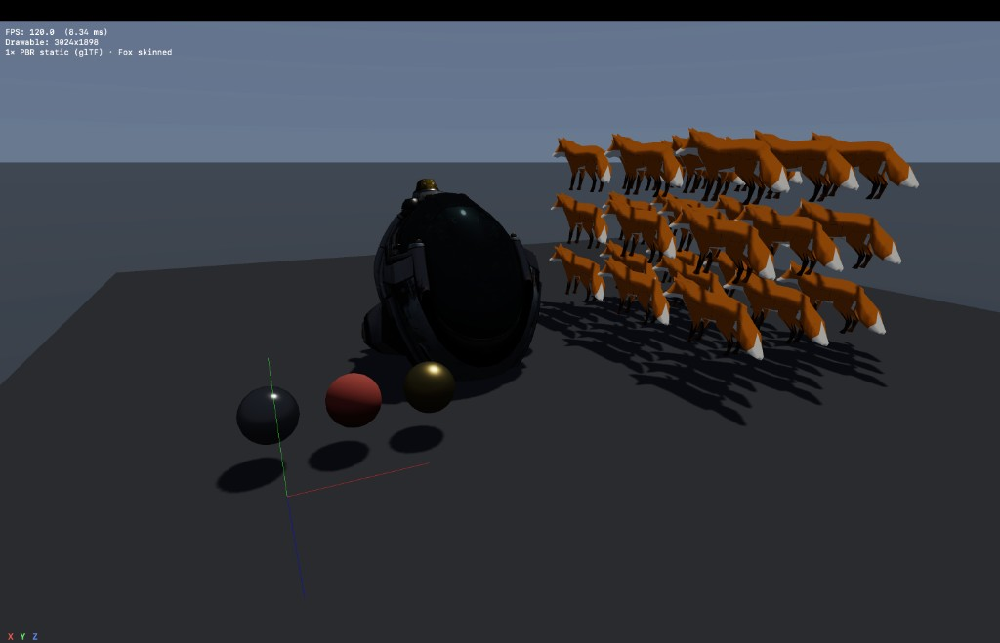

# BestGame

Просмотрщик **3D** на **Swift** и **Metal** (macOS / универсальная схема Xcode): загрузка **glTF 2.0 / GLB**, PBR metallic-roughness, скиннинг, процедурный пол и сферы-пробы, направленный свет с картой теней, небо и упрощённый IBL.

| Сцена: сферы, шлем, сетка лис, тени | Шире: полка ассетов и лисы |
| --- | --- |
|  |  |

## Что в проекте

- **Metal**: модульные исходники в `BestGame/MetalShaders/` — общий заголовок `ShaderShared.h` (типы, BRDF, небо для тумана), отдельные файлы проходов `SolidColorPass.metal` (куб/отладка), `SkyPass.metal` (полноэкранное небо), `PBRPass.metal` (статический и скиннутый PBR, тени). Путь к заголовку задаётся в таргете: `MTL_HEADER_SEARCH_PATHS = $(SRCROOT)/BestGame/MetalShaders`.
- **Рендер**: один color-pass с глубиной; первым рисуется небо; затем статические GLB, инстансинг скиннутой лисы (**Fox**), пол, сферы; отдельный проход в depth-текстуру для PCF-теней.
- **Загрузка GLB**: glTF JSON, бинарный чанк, аксессоры, материалы MR (`GLBLoader`, `GLTF*`).
- **Сцена**: `DemoScenePlacements` — слоты под несколько ассетов из `BestGame/Assets/Models/` (например **DamagedHelmet**, **Fox**), процедурный пол и три сферы (`DemoProceduralGeometry`), runtime equirect env (`EnvironmentMap`).
- **Свет**: единое солнце (`SceneLighting`) — направление, ключ в PBR, диск в небе, согласованный туман в шейдере; `Renderer+Shadows` — орто frustum под сцену.
- **Ввод**: мышь (обзор), WASD + QE, `Shift` — ускорение; `Esc` — выход (`GameMTKView`, `FlyCamera`).

## Требования

- macOS с **Metal**
- **Xcode** (objectVersion 77, Swift 5)

## Сборка

Откройте `BestGame.xcodeproj`, схема **BestGame**, цель **My Mac**, ⌘R.

## Ограничения

- IBL — не полноценный префильтрованный cubemap, а лёгкий equirect + аналитическое солнце и хак «солнце в отражении» на металлах.
- Поддерживается узкий подмножество glTF, достаточный для Khronos sample models в репозитории.

## Лицензии ассетов

Модели из [glTF Sample Models](https://github.com/KhronosGroup/glTF-Sample-Models) — см. лицензии в оригинальных репозиториях.
