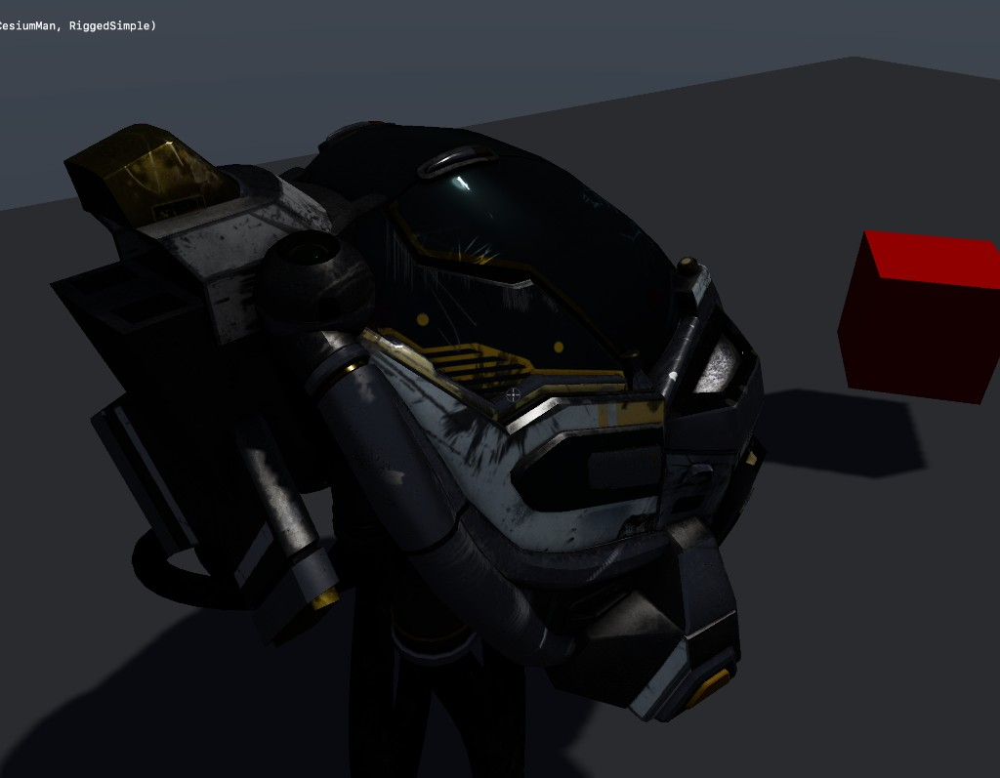
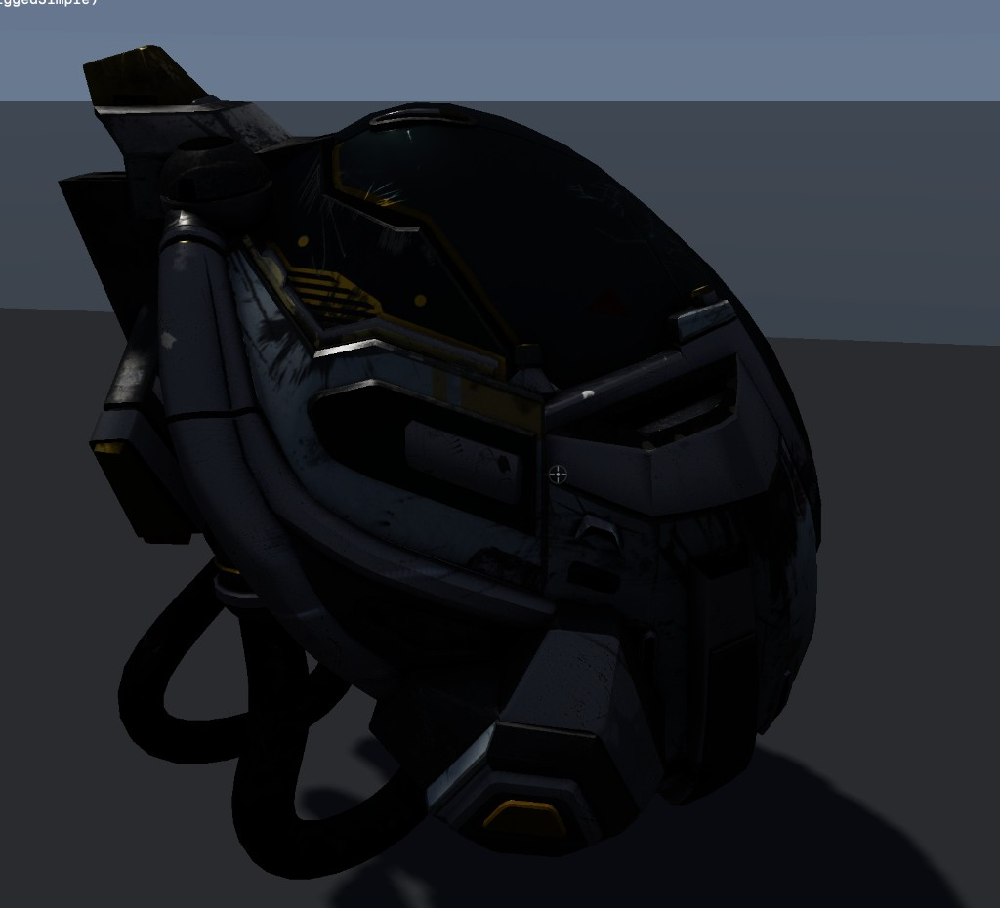

# BestGame

Демо **рендерера 3D** на **Swift** и **Metal** для **macOS**: загрузка **glTF 2.0 / GLB**, PBR metallic-roughness, скиннинг и инстансинг, направленный свет с картой теней (PCF), процедурное небо, упрощённый IBL из equirect, **густая процедурная трава** (инстансинг), **река** (плоскость с волнами, Френель, пена по глубине, отражение из env), **GPU-слой эффектов** (взрыв частиц, светлячки), **пост-солнечное ослепление** по mips, свободная камера и оверлей интерфейса поверх `MTKView`.

| Текущая демо-сцена (трава, полка, лисы, HUD) | **DamagedHelmet**, крупный план | Статический PBR, небо и тени |
| --- | --- | --- |
|  |  |  |

## Возможности

- **Статический PBR** для нескольких GLB на «полке» сцены (например BoomBox, Box, DamagedHelmet), тени от направленного света.
- **Скиннутый PBR** для нескольких моделей (например Fox с сеткой инстансов, CesiumMan, RiggedSimple), анимации по клипам glTF.
- **Процедурная геометрия**: пол, три сферы-пробы материалов (диффуз / диэлектрик / металл).
- **Трава**: плотное поле инстансированных «лезвий» с ветром в вершинном шейдере; полоса реки без травы (чтобы вода была видна).
- **Вода (река)**: узкая полоса по сцене, волны в VS, смешение с IBL-отражением, мягкая пена по сравнению с буфером глубины (без отдельного RT под преломление).
- **Эффекты кадра** (compute + пост-непрозрачный pass): аддитивный взрыв частиц, светлячки; солнечный ореол / лёгкое ослепление с mips поверх кадра.
- **Интерфейс**: FPS и строка состава сцены в левом верхнем углу; компактный **гизмо мировых осей** X/Y/Z с подписями у концов; **прицел** в центре экрана (полупрозрачный крест и точка); над игровым видом **скрывается системный курсор**, чтобы не отвлекать (при уходе указателя с вида или при потере фокуса окна курсор снова виден).
- **Ввод**: вращение камеры (ПКМ + движение мыши), WASD и полёт по высоте (QE), ускорение Shift; Esc завершает приложение.

## Структура кода (кратко)

| Область | Файлы и назначение |
| --- | --- |
| Точка входа SwiftUI | `BestGameApp.swift`, `ContentView.swift`, `MetalView.swift` |
| Окно и ввод, HUD, прицел, курсор | `GameMTKView.swift`, `GameHUDSink.swift`, `InputState.swift` |
| Кадр Metal, тени, сцена | `Renderer.swift`, `Renderer+MTKView.swift`, `Renderer+Pipelines.swift`, `Renderer+Shadows.swift` |
| GLB / glTF | `GLBLoader.swift`, `GLBTypes.swift`, `GLTF*.swift` |
| Статический и скиннутый меш | `StaticModelRenderer.swift`, `SkinnedModelRenderer*.swift` |
| Трава и вода | `GrassInstancedRenderer.swift`, `RiverWaterRenderer.swift` |
| GPU-эффекты кадра | `BestGame/Effects/` — координатор, burst, fireflies, солнечный glare |
| Раскладка демо | `DemoScenePlacements.swift`, `ScenePlacementProviding.swift`, `DemoAssetsLoader.swift` |
| Шейдеры | `BestGame/MetalShaders/` — `ShaderShared.h`, `PBRPass.metal`, `SkyPass.metal`, `SolidColorPass.metal`, `GrassInstanced.metal`, `WaterRiver.metal`, `ParticleBurst.metal`, `FireflyDrift.metal`, `SunOcularGlare.metal` |
| Камера и математика | `FlyCamera.swift`, `Math.swift` |
| Небо, тени, отладка | `SkyRenderer.swift`, `ShadowMapRenderer.swift`, `DebugDraw.swift`, `WorldAxesGizmo.swift` |

## Требования

- macOS с **Metal**
- **Xcode** (см. `BestGame.xcodeproj`, Swift 5)

## Сборка и запуск

Откройте `BestGame.xcodeproj`, схема **BestGame**, назначение **My Mac**, затем ⌘R.

## Ограничения

- IBL не на полном префильтрованном cubemap: equirect окружение плюс аналитическое солнце и упрощённые отражения на металлах.
- Вода без захвата цвета сцены под «настоящую» рефракцию — имитация затемнения и Френель.
- Поддерживается ограниченное подмножество glTF, достаточное для выбранных демо-моделей в репозитории.

## Лицензии ассетов

Модели из [glTF Sample Models](https://github.com/KhronosGroup/glTF-Sample-Models) — условия см. в исходных репозиториях Khronos.
